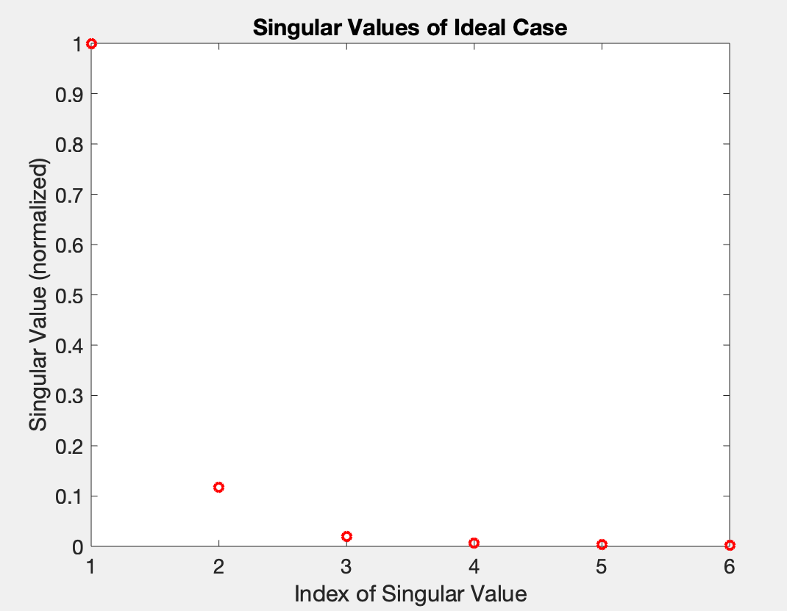
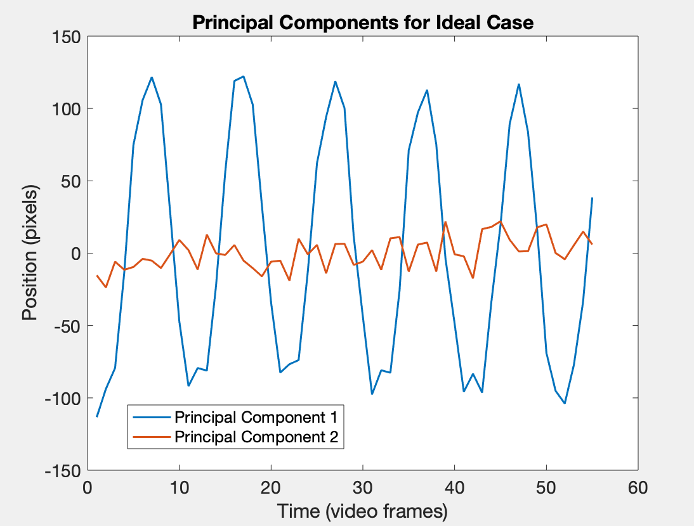
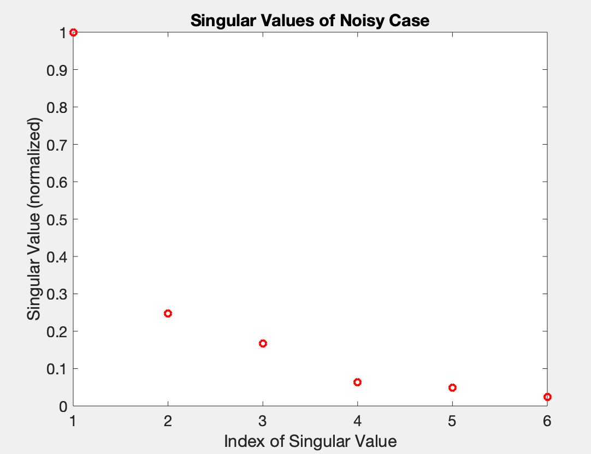
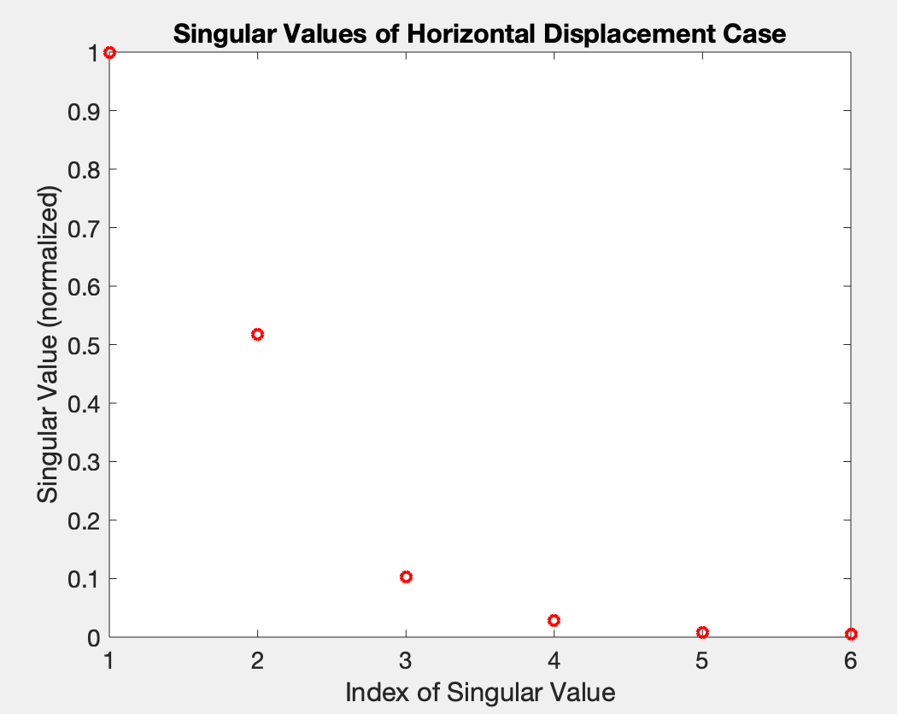
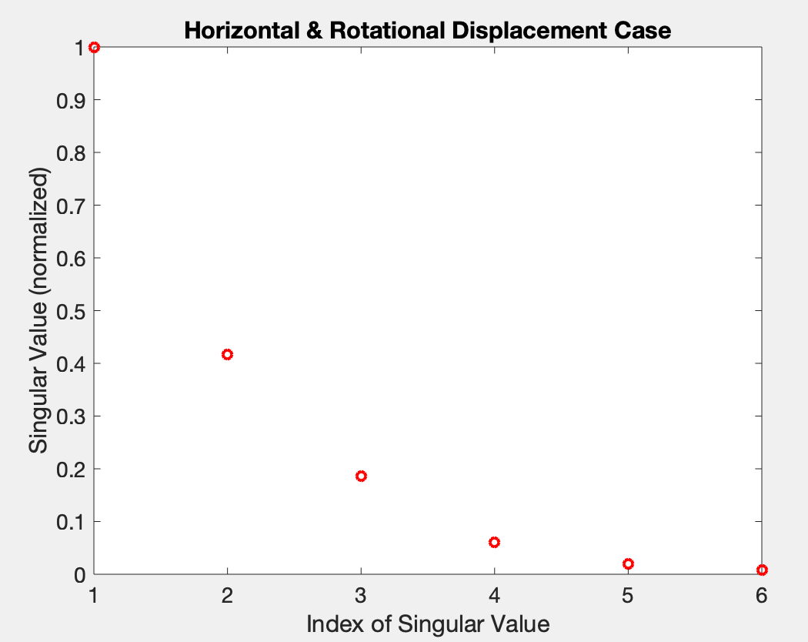
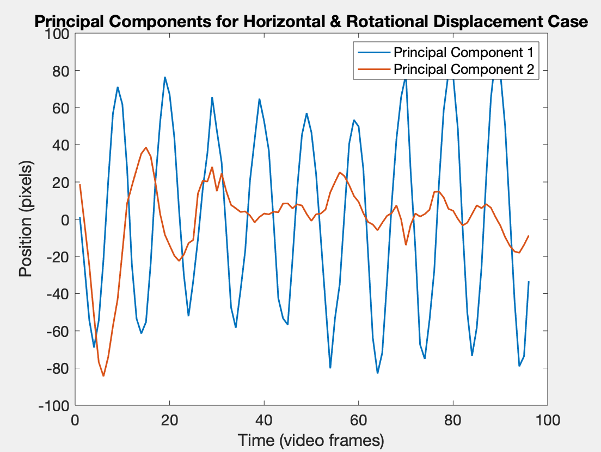
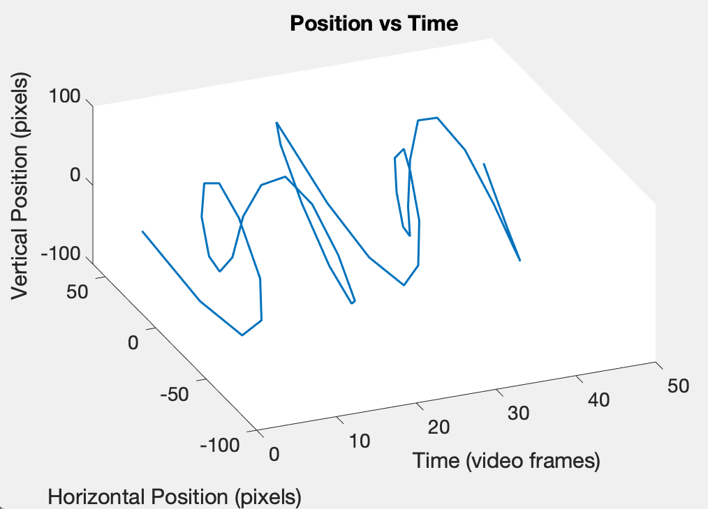

# Assignment 3: A Spring-Mass System

In this assignment, we are given four sets of three videos of a paint
can attached to a spring. Each set of videos provides a unique angle of
the event, which are all roughly synchronous with the other videos in a
set. This gives us a six dimensional view of a largely one or two
dimensional system, which describes the motion of the object with a lot
of redundancy. To eliminate some of the unnecessary dimensions and
approximate the paint can’s motion, we will utilize Principal Component
Analysis (PCA) to estimate the true rank of the system. However, before
this can be accomplished, the videos of the cans must be analyzed to
track the movement of the object in each frame. In order to do so, a
light is attached to the paint can to distinguish it from the rest of
the image.  
  
Each of the four sets we are given provide a distinct challenge to the
analysis of the paint can’s motion, and an greater insight into the
fundamentals of PCA. The first set is the most basic example of the
spring, moving largely along a single dimension with clean videos of the
event. The second set is the same motion as the first, except with much
shakier and noisier videos, making it more difficult to extract the
spring’s true motion. The third and fourth video sets are separate
examples of the paint can bouncing vertically and horizontally, but in
the fourth set, rotation is added to the paint can, at times obscuring
the light attached to the paint-can used for tracking the object.

# Theoretical Background

Principal Component Analysis is largely built upon the concepts of
Singular Value Decomposition (SVD), which transform the vectors of a
matrix into distinct orthogonal components based upon its singular
values, denoted by . More formally, given any matrix
, this transformation finds the
diagonalization of its singular values 
of A in terms of full
rank, unitary matrices 
and .

An important application of these singular values is their use in
determining and approximating the rank of a matrix. Because matrices U
and V are full-rank, the rank of A must be determined by the rank of
. Because  is a diagonal matrix, and zeroes in its
diagonal correspond to a reduce in rank. Similarly, the rank of a matrix
is determined by the number of non-zero singular values. However, in the
analysis of real life data, noise will likely be included in its
collection, and in practice, any near-zero values will likely still
signify the same meaning. Using this notion, we can easily create low
rank approximations of A by omitting vectors of U and V corresponding to
near-zero singular values.  
  
Central to the ideas of Principle Component Analysis (PCA) is the
covariance matrix , which stores the variance between each
combination of vectors of matrix X. With the assumption that the mean of
each vector is 0, the variance, , of two vectors is found as
below. 

    
Therefore, with this assumption, the covariance matrix can be defined as
below, where diagonal entries relate to the importance of the respective
measurements of a vector.  
    

    
In PCA, we hope to reduce the redundancy of inputted measurements and
isolate the important structures in the data. To do this, we will
convert our information to the basis of U associated with the SVD.  

From which, its covariance is easily calculated.

# Algorithm Implementation and Development

Before we can apply PCA on each set of videos, we must first extract the
motion of the paint can from every camera perspective. With the
assistance of the light atop the paint-can, we will combine a bright
pass filter with low level motion detection to isolate the paint can in
each frame. In each test, the position of the paint can through time
will be captured in each video and then combined to apply PCA. The
following procedure is repeated to each set of test videos.

## Preprocessing

Before processing, each video must first be converted into a three
dimensional array composed of pixel values for every frame in the video.
Using MATLAB functions `im2gray` and `im2double`,
each image is converted into grayscale and then the pixel values are
converted into fractional values in the range [0, 1]. With a
correctly formatted set of videos, the number of frames is aligned by
comparing the videos manually and inputting the number of frames to
delay each video to synchronize them. The total number of frames is then
compared and cropped to create videos of equal length. Additionally, due
to complications in tracking the object, videos are sampled identically
by taking a single frame per every 3-5 frames. Videos may also be
cropped to avoid outstanding noise created by the tracking algorithm
explained below.

## Tracking

In order to capture the brightness created by the attached flashlight, a
highpass filter is applied to each frame of each video. Pixel values
below a chosen partition are set to zero, excluding any features of the
video which are not bright. Next, with the remaining bright components
of the filtered videos, the motion of each pixel is estimated by finding
the absolute value of the difference between each frame and the last.
This process effectively removes most stationary features in the video,
but produces some noise due to minor shifts in the frames. To compensate
for this, each image is slightly blurred by applying a Shannon filter to
the image in frequency space. Now, with only bright, moving objects
remaining in each image, a second high pass filter is applied to remove
any noisy data reduced by the Shannon filter. The remaining data in each
frame is understood to be the location of the paint can, and an average
of the locations of the remaining white pixels is taken to be the
location of the can.

## Principle Component Analysis

Having now obtained the x,y position of the object throughout each
video, a matrix can be created by appending the x and y position vectors
from each camera’s perspective. From the 2 dimensions from the 3 videos,
6 measurements are described for every remaining video frame. The
average of each vector is determined using `mean` and is then
subtracted from its vector, ensuring that the average of each
measurement is zero in alignment with our earlier assumption. Next, the
SVD is computed using the very convenient `svd` MATLAB
command. With the U, , and V matrices discovered, our
measurements can be projected along the prominent axes present in the
data but multiplying our matrix by . The vectors of this matrix
are the principal components of our data, and the singular values of
 relate to the variance of each measurement.

# Computational Results

## Ideal Case

The first set of videos demonstrate the paint can bouncing vertically
with minimal shaking of the cameras. Because of this, the positions of
the object were extracted successfully with the tracking algorithm,
besides for the inclusion of several duplicate frames which create
extraneous data. For this reason, video frames were sampled as described
earlier, which lessened this effect. The few remaining ’NaN’ values were
replaced by interpolation of the surrounding data. With clean data, the
singular values and principle components nicely reflected the nature of
the motion. The variance of the first principle component, the square of
the first singular value, is significantly larger than all others,
suggesting the dominance of motion in a single direction, which we know
to be true. Similarly, the first principal component displays simple
harmonic motion, and the second principle component largely resemble
noise of the system, affirming our understanding from the video.

     

## Noisy Case

The same motion as the ideal case was similarly captured in this set of
videos. However, they include much more noise created by the shaking of
the cameras. This was a true test for the tracking algorithm
implemented, and required significant tuning of its parameters to obtain
a decent approximation of the objects motion. This set of videos also
required manually determined cropping to isolate the location of the
paint can and remove prominent noisy sections. Even then, the SVD of the
processed data produced several significant singular values, with the
second value almost reaching a fourth of the first variance. Because
these videos correspond to the same motion featured in the ideal case,
we know that subsequent dimensionality of the principle components are
attributed to noise in the system. The significant principle components
reflect this: the first vector displaying moderately clean sinusoidal
motion, while the following principle components display the loud noise
present in the system.

     

## Horizontal Displacement Case

This set of videos introduces a second dimension of motion by moving the
object vertically and horizontally. Given the previous tools for
processing and tracking the videos, not much had to be developed in
order to capture the position of the object in this set. The SVD of
these measurements create two primary singular values, with normalized
variances of 1.0 and 0.5. This is assumed to correspond to the motion in
the vertical and horizontal directions respectively. Like the previous
cases, there is a strong vertical component which relates to the
object’s vertical motion. Similarly, second principle component likely
relates to the horizontal motion added to this test. While the remaining
variances of the principle components are 0.1 or below, the third
principle component still expresses sinusoidal motion instead of the
typical noise we have seen in the other cases. This is potentially part
of the motion of the two prominent axes which was somehow separated.
Overall, the first two principal components seem to describe the motion
of both dimensions accurately, with the motion of the principle
components mirroring the movement of the paint can.

     

## Horizontal Displacement and Rotation Case

this set of videos expresses the same vertical and horizontal motion
described in the last section, but also adds rotation to the paint can,
and more importantly, the flashlight. While the vertical bouncing is
similar to the previous cases, the horizontal motion is distinct from
that of the last case, with the motion decaying much quicker
horizontally. Despite the lack of the flashlight present, the tracking
method still managed to pick up on the object with a little tuning. This
is likely because of the white sections of the paint which were detected
as moving. When the SVD was computed, two to three strong singular
values were found. Similar to the previous example, the first two likely
relate to the vertical and horizontal directions. While the first
component expresses a strong sinusoidal motion, the second component
displays a decaying swing as was previously described as the horizontal
motion of the object, but with a messier signal closer to the end of the
video. Perhaps the addition of the abnormally strong third singular
value would smooth this motion out. The rotation of the can could have
caused this noise, as the lighter parts of the can express horizontal
movement from the perspective of the tracking algorithm.

     

 

# Summary and Conclusions

Given three sets of camera perspectives of the same object, we were able
to track its motion and reduce the redundancy of the system. These tests
highlight the power and limits of the singular value decomposition and
principle component analysis. While in most cases we were able to track
and deconstruct the objects motion in the vertical and horizontal
directions, finding consistent locations of the object proved difficult,
and bad input data leads to bad output data. Regardless, most cases
produced accurate rank approximations with less than or equal to 3
principal components, reducing the dimensionality of our data by half,
and proving itself as an effective tool for organizing, reducing, and
interpreting data.

# MATLAB Functions

  - `f = fft2(I)` returns the Discrete Fourier Transform of image `I`
    along two dimensions, inverting the indices on both sides of the
    axis.

  - `ind = find(I < x)` returns the indices of the image `I` which
    satisfy the condition expressed as the paramete.

  - `I = ifft2(If)` returns the inverse of the two dimensional Discrete
    Fourier Transform of image `If`.

  - `I = im2double(I)` converts an image `I` from \([0,255]\) integer
    pixel values to doubles within \([0,1]\)

  - `I = im2gray(I)` converts an RGB image to a grayscale image.

  - `[x, y] = ind2sub(size, ind)` returns the coordinates corresponding
    to the single index for the `size` of a given
object.
