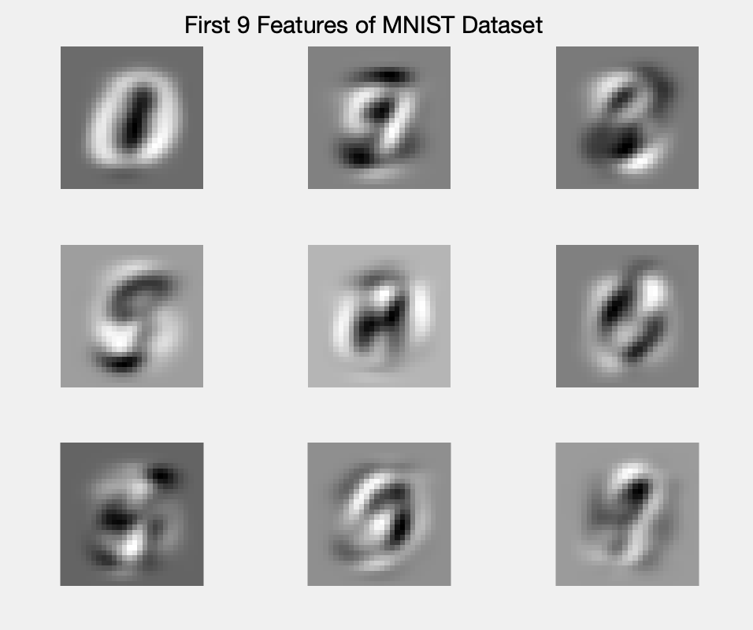
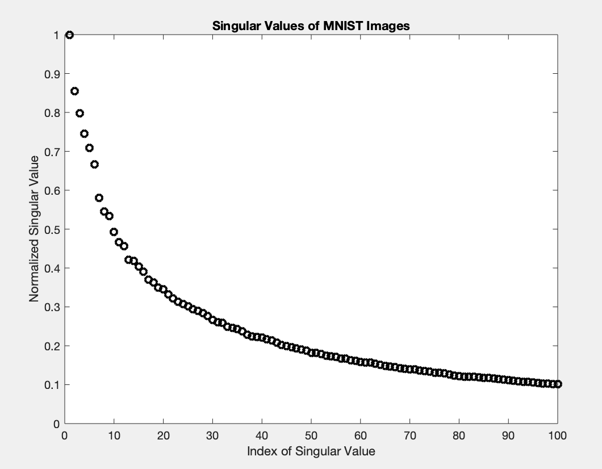
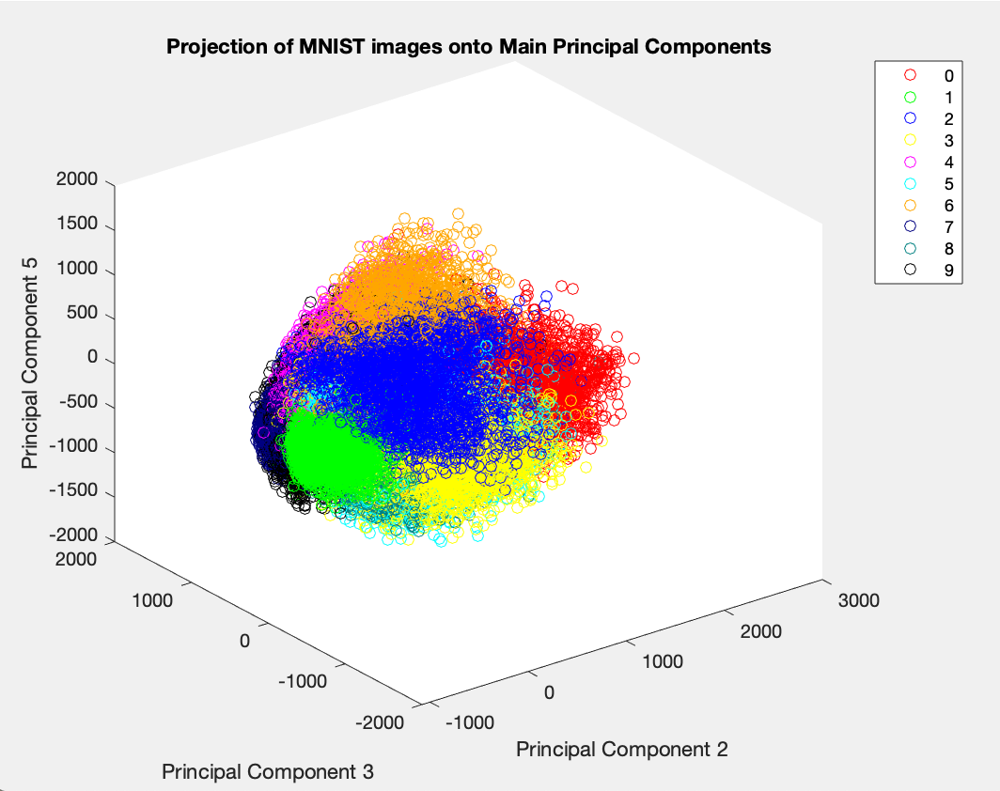
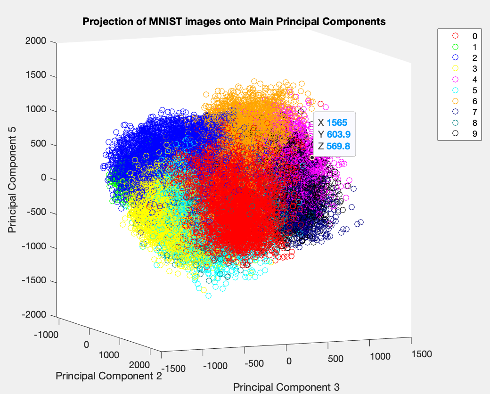
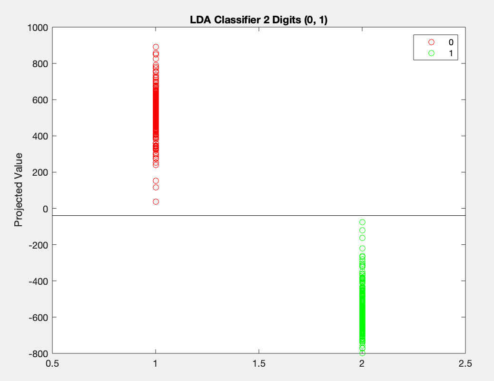
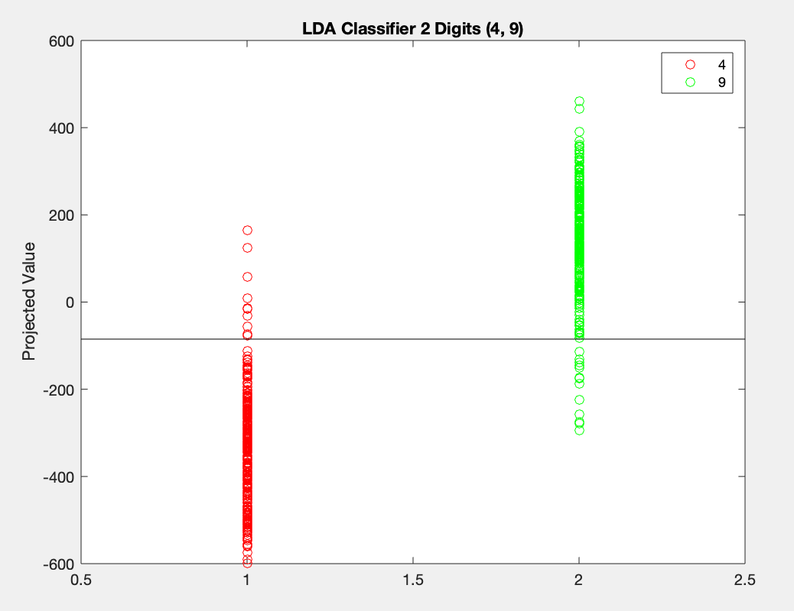
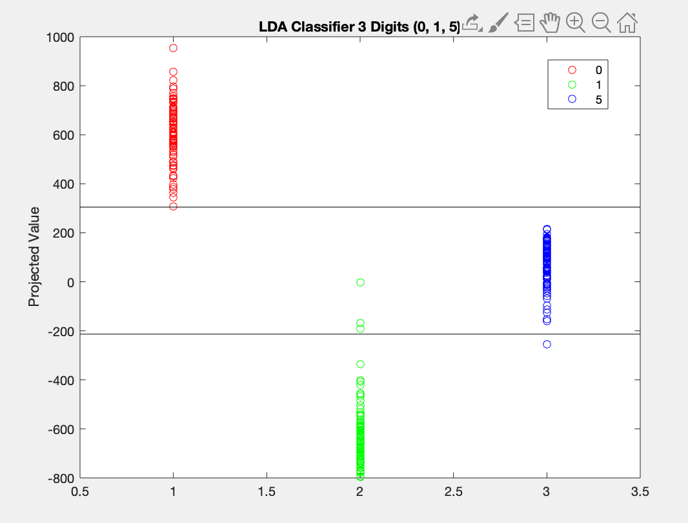
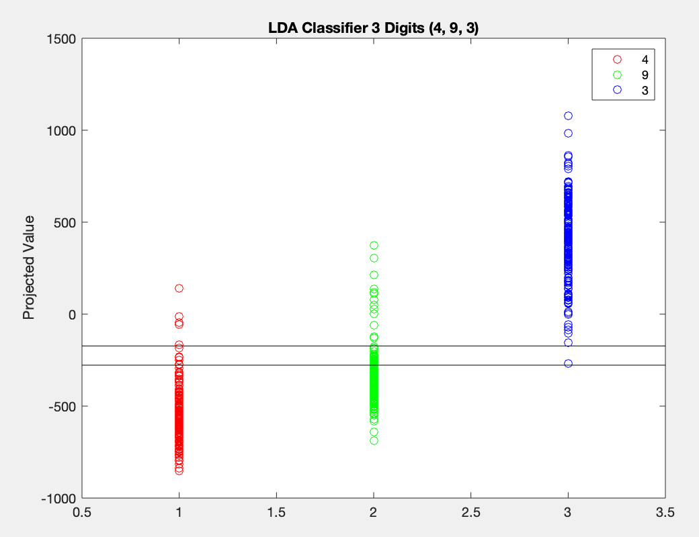

# Assignment 4: Handwritten Digit Classification

In order to explore the effectiveness of different classification
methods, we will analyze the MNIST dataset, a collection of over 60,000
images of handwritten digits (0 through 9). Each image is normalized and
centered in a 28 by 28 grayscale image. In order to identify the
features of our dataset, we will apply Principle Component Analysis
(PCA) using Singular Value Decomposition (SVD). This will convert our
data into an orthonormal basis, which will highlight important trends
and differences between the varying handwritten digits. The first
several principal components will act as a feature extraction tool,
which also compresses our storage of each image.  
  
Through our analysis, we will employ several different classification
tasks, e.g., distinguishing between 2 different digits, several digits
in the dataset, and even all 10 digits at once. Using the features
developed through PCA, we will create three classifiers to test and
compare effectiveness. Most notably, we will implement Linear
Discriminant Analysis (LDA), i.e., finding the optimal projection of our
features to a singular dimension in order to separate subsets of two or
three different digits of our dataset. Additionally, we will train
Decision Trees and Support Vector Machines using provided MATLAB tools,
which will create well performing models to contrast against our LDA
classifier.

# Theoretical Background

### Principal Component Analysis

Principal Component Analysis is largely built upon the concepts of
Singular Value Decomposition (SVD), which transform the vectors of a
matrix into distinct orthogonal components based upon its singular
values, denoted by . More formally, given any matrix
, this transformation finds the
diagonalization of its singular values  of A in terms of full
rank, unitary matrices  and .

    
In PCA, we hope to reduce the redundancy of inputted measurements and
isolate the important structures in the data. To do this, we will
convert our information to the basis of of the transformation associated
with the SVD.  

### Linear Discriminant Analysis

Given a multidimensional dataset, Linear Discriminant Analysis (LDA) is
a method to separate data in regards to certain clusters present in the
data. In order to do so, we search for a projection \(\mathbf{w}\) onto
one dimension which best isolates the clusters on a line. Thus the
optimal projection must maximize the separation between each cluster’s
mean, while also minimizing the variance within each class. More
formally, denotes these values as  and  respectively, where there are \(\mathbf{k}\) clusters, and
 represents the means of each feature.

Thus the optimal projection can be expressed below. This fortunately
also equates to the Rayleigh Quotient, which can evaluated as a
generalized eigenvalue problem.
    

    

### Decision Trees & Support Vector Machines

Decision trees are a regression and classification tool which develop a
model to evaluate an input based on any number of prominent partitions
in the data. To train a model, the most important distinguishing factors
are determined and evaluated at the top of the tree, and less dominant
features are then used to categorize the input until a definitive
response is met. Once the tree is optimized to a satisfactory threshold,
new data can be evaluated by following the flow of decisions along the
tree.  
  
Support vector machines, another classification tool which we will
implement, ultimately rely upon creating a hypersurface along the
dimensionality of the inputted data. It optimizes this hypersurface in
order to minimize the error, or misclassification of the training data.
It does this through quadratic programming via the L1 norm.

# Algorithm Implementation and Development

### Preprocessing

In order to set up our experiment, we first download and process the
MNIST dataset using the provided custom MATLAB function `mnist_parse`,
which produces the desired images the digits, alongside a vector of its
corresponding label. Before processing, we reshape the pixels in each
image to form a single vector, as the position of the pixels in the
frame will have no effect on our analysis. Additionally, the integer
value of each pixel is converted into fractional (double) values in the
range [0, 1]. Before applying Singular Value Decomposition, the
averages of each row are subtracted from itself in order to ensure that
the rows have a mean of 0. Then the reduced SVD of the dataset is
computed using the `svd` MATLAB command.

### Linear Discriminant Analysis Classifier

Using the SVD matrices we obtained previously, we project our dataset
onto its orthonormal basis, such that we can easily identity and isolate
the most prominent features which distinguish the digits. In order to
create a classifier between 2 or more numbers, first we filter our
dataset to only include the desired digits and their respective labels.
To find the optimal projection, we use this data to calculate
 and , i.e., the matrices which
encapsulate the differences between the averages of each feature, and
the variance of each feature for each digit, respectively. Then we
produce the optimal projection by obtaining the eigenvector
corresponding to the largest generalized eigenvalue. With the projection
found, we then find a threshold between the clusters which best
separates the digits. To accomplish this, an iterative algorithm is used
which settles on the minimum number of overlapping observations of
different classes. The model is then tested by applying equivalently
processed test data and determining the number of accurate predictions.

### Decision Tree & Support Vector Machine Classifiers

In order to create other classifiers for this dataset, we utilize MATLAB
implementation to train a decision tree and a support vector machine
with the principal components of the MNIST dataset. With the SVD
matrices obtained earlier, we project the images onto its orthonormal
basis. We also filter the images based on their labels to only include
the digits we intend to classify. This set of images is then split into
training and testing subsets to later quantify each classifier’s
success. To create the decision tree, we input the training images and
their labels into the `fitctree` MATLAB function. The error is then
computed with the `kfoldloss` function. Similarly, to create the support
vector machine, we must first scale our projection to smaller range,
using `rescale`,in order for our model to converge. Then we can simply
use the `fitcecoc` function, which has the capability to classify
multiple classes. When only two classes are created, it behaves
similarly to the `fitcsvm` function we were recommended in class. To
find the success rate / error of the support vector machine, we use our
modeal to predict the test labels using `predict`.

# Computational Results

     

### Singular Value Decomposition Analysis

After removing the mean from the rows of each image, the prominent
features of the digits were easy to reveal. Without removing the mean,
the largest singular value dominated the rest, which seemed to
correspond to the shared background of all the images. Once removed, the
singular values are more balanced, as they slowly decrease and remain
relevant until approximately 100, as can be seen in
Figure 2. The most prominent features
corresponding to the dominant singular values can be seen in
Figure 1, which vaguely resemble certain parts of
some of the digits. Using the projection found by the SVD, we can create
a scatter plot of the different digits along its prominent principle
components. Seen in Figures 3 and 4, the digits appear fairly well
separated even along only 3 dimensions of the projection.

     

### Linear Discriminant Analysis Classifier

Obtaining the optimal projection for distinguishing the different digits
worked well for all combinations of classes. Even with relatively low
numbers of features inputted, the projection was still largely
successful. As the number of features increased, the accuracy of the
separation very slowly increased until about 100, were accuracy began to
decline. This classifier is very accurate for separating only two
digits. All of the combinations were between 93-99% effective. The
easiest digits to separate were visually simple and distinct. Separating
the handwritten zeros and ones was the most successful task, with a
99.9% accuracy when accessing the model with unused test data.
Alternatively, separating digits with common features proved more
difficult. For example, the fours and nines produced the lowest accuracy
separation, with 93.8% of test images being categorized successfully. It
was also feasible to create classifiers with 3 different digits. While
many performed poorly, the best was created by adding another visually
distinct number to the 0,1 grouping. Separating 0, 1, and 5 created a
model which displayed 98% accuracy on new data. However, despite the
success with low quantities of classes, the results decreased
significantly when tasked with more than 3 digits to classify at the
same time.

     

### SVM and Decision Tree Classifiers

With the built in MATLAB functionality to implement these classifiers,
the process was very straightforward. With the decision tree, the
maximum number of decisions can be inputted as a parameter, as a means
to prevent overfitting. Depending on the number of classes being
evaluated, the tree naturally would grow or shrink, and a constant
maximum was not effective for all trees. In general, for 2 digits, we
found that 100 decisions was a good trade off between accuracy and fit.
When evaluated with all 10 digits, this classifier achieved up to 85%
accuracy, a large improvement over the LDA method. However, the decision
tree was slightly worse at classifying two digits, averaging around 95%
depending on the pair. When classifying between 0 and 1, this method
similar succeeded with an accuracy of 99%. The worst binary grouping for
this classifier was 3,5, which only successfully categorized 92.3% of
test data.  
  
  
The support vector machine produced similar results. Comparatively, this
classifier handled all ten digits very well, at times producing an
accuracy of around 92%. However, this model is not significantly better
than the other tools when using it to classify only two digits. The
easiest digits, (0,1), created a classifier which was similarly 99.9%
successful on reserved test data. On the other hand, the hardest digits
for this method, (3,5), produced an accuracy of 93.8%, less than that of
the LDA model. The overall accuracy of the model seemed to be related to
the number of features that were passed into the SVM. The best
predictions were created with between 20 and 100 features. While the
training data accuracy improved with additional features, its
performance on test data declined gradually. Therefore we chose to use
50 features to avoid possible overfitting.

     

# Summary and Conclusions

The MNIST is a famous dataset for testing and improving machine learning
techniques. Through our analysis of it, we have implemented three
classification models using very different techniques. Through comparing
and contrasting their effectiveness, we have learned a lot about their
functionality, quirks, and limitations. This assignment also reinforces
an understanding of Principal Component Analysis, which is used in order
to distinguish the prominent features from the digits. Overall, through
our analysis we have seen that Linear Discriminant Analysis is a very
effective tool for tasks with low number of classes, while decision
trees and support vector machines are more capable of handling more
complicated tasks.

# MATLAB Functions

  - `[images, labels] = mnist_parse` formats and returns a three
    dimensional array of all the images as well as their labels.

  - `ind = find(I < x)` returns the indices of the image `I` which
    satisfy the condition expressed as the parameter.

  - `[U,S,V] = svd(data)` applies singular value decomposition to the
    dataset and returns the two orthnormal matrices U and V, as well as
    the diagonal matrix of its singular values, S.

  - `data = rescale(data)` converts the scale of the input to the range
    of \([0,1]\).

  - `data = reshape(data, n, m)` transforms the shape of a dataset to
    the dimensions defined as parameters.

  - `tree = fitctree(train_images, train_labels)` builds and trains a
    decision tree classifier model.

  - `tree = fitcecoc(train_images, train_labels)` builds and trains a
    multi-class support vector machine classification model.

  - `error = kfoldLoss(tree)` returns the error of a cross-validated
    decision tree.

  - `pred_labels = predict(model, test_images)` given a classification
    model and input data within its scope, this function using the model
    to predict and return the expected output from the
data.
